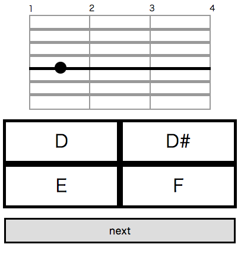
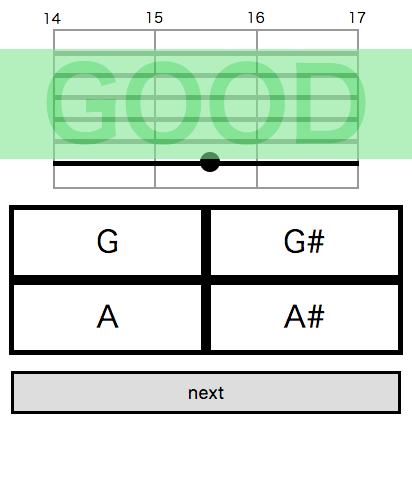
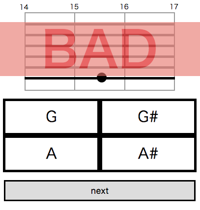

# Q-Pitch

|   |   |   |
|---|---|---|

Q-pitch is quiz game that guess what the pitch is how you watch figure of fingerboard of guitar.

Q-Pitchはギターの指板の図を見て音名を当てるクイズゲームです。

## REQUIREMENT

- node.js >= 6.8.1

## GET START

`$ npm start`

## To Do

- 過去問チェック
- 結果一覧
- 回答スピード表示
- 正解率 / 回答スピード一覧

